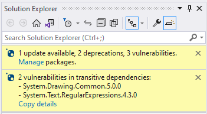
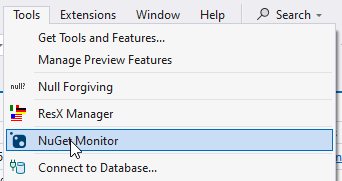
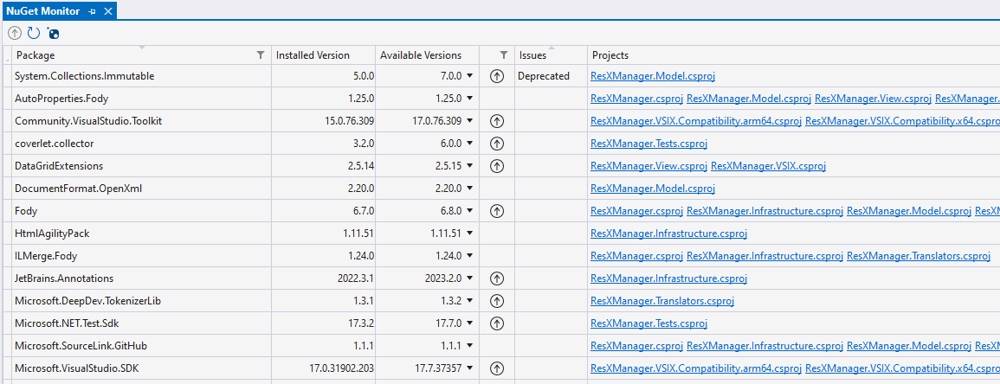
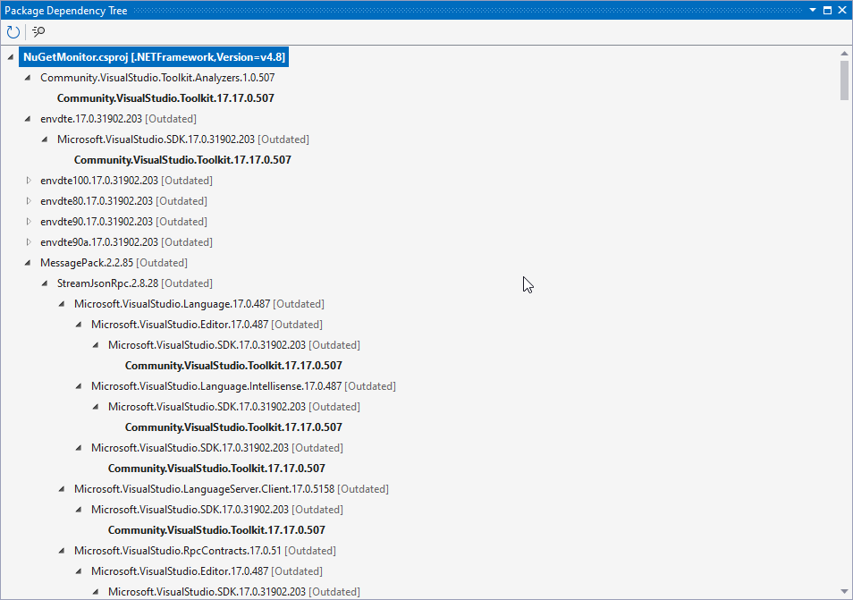

# NuGet Monitor

A Visual Studio extension that checks and notifies about available updates
for the installed NuGet packages in the current solution.

[](https://github.com/sboulema/NuGetMonitor/actions/workflows/workflow.yml)
[](https://github.com/sponsors/sboulema)

## Features

- Checks for updates, deprecations and vulnerabilities when a solution is opened
- Shows an info bar with the number of available updates, deprecations and vulnerabilities
- Shows an info bar with vulnerabilities found in transient packages
- Provides a package management tool window that gives an instant overview over all packages, with a lean and fast package update functionality
- Works with .NET Framework projects and with .NET projects using `PackageReference` items

## Supported Visual Studio versions

- Visual Studio 2022 (Untested)
- Visual Studio 2026

## Installing

[Visual Studio Marketplace](https://marketplace.visualstudio.com/items?itemName=SamirBoulema.NuGetMonitor) [](https://marketplace.visualstudio.com/items?itemName=SamirBoulema.NuGetMonitor)

[GitHub Releases](https://github.com/sboulema/NuGetMonitor/releases)

[Open VSIX Gallery](https://www.vsixgallery.com/extension/NuGetMonitor.2a6fbffe-f3fd-4bf8-98cc-5ae2c833a1c7)

## Usage

### After a solution is loaded, available updates and possible issues are shown in the Solution Explorer



Dependent on the size of the solution it may take some time until the info bars appear. 

---
### Package Manager

The package manager can be opened via the entry in the `Tools` menu.



The package manager shows all installed packages of the current solution. Updating a single package is just one click, multiple packages can be updated via the tool bar button after selecting the packages.

Compared to the original NuGet Package Manager updating packages is very fast, because the package version is instantly updated without validation against other packages - however version conflicts may show up only at the next build and have to be resolved manually.



Shared package references, e.g. in the `Directory.Build.props` file, are handled gracefully, and will not be replaced by `Update` entries in every project.

CentralPackageManagement (`PackageVersion` entries) are supported as well.

A version can be pinned by adding the `IsPinned` property to `PackageReference` or `PackageVersion` entries, to stop NuGetMonitor
from offering to update this version, if e.g. updating the package might break some functionality.
This is an alternate approach to using the package range notation `[13.0.1]`, that avoids side effects on dependent projects, e.g. when creating a NuGet package.
```xml
<PackageReference Include="Newtonsoft.Json" Version="13.0.1" IsPinned="true" />
```

A version can also be pinned to a specific range by adding the `PinnedRange` property to `PackageReference` or `PackageVersion` entries, to limit updates to a specific range of versions.
```xml
<PackageReference Include="Newtonsoft.Json" Version="13.0.1" "PinnedRange="[13.*, 14.0)" />
```

A justification property can be added to `PackageReference` or `PackageVersion` entries, to e.g. document why a reference is pinned and can't be updated
```xml
<PackageReference Include="Newtonsoft.Json" Version="[13.0.1]" Justification="Can't update due to Visual Studio extension limitations">
```

A mitigation element can be added to suppress warnings for transitive dependencies that can't be updated due to project limitations
but have been evaluated to not affect the product security.
```xml
<PackageMitigation Include="Newtonsoft.Json" Version="13.0.1" Justification="Can't update due to Visual Studio extension limitations">
```
---
### Dependency Tree

This view allows to investigate how transitive dependencies are introduced into the projects.

It lists all transitive dependencies per project, and shows their ancestor tree, where the terminal bold entry is the package reference used in the project.

The context menu for every entry offers to copy ready made XML snippets for `PackageReference`, `PackageVersion` or `PackageMitigation` that can be directly inserted into the project file to fix transitive dependencies.



## Thanks

### AnushaG2201

A big thanks goes to [AnushaG2201](https://github.com/AnushaG2201)!

I was playing with the idea for this extension for quite a while but never figured out how I would create this extension.

That is until I saw the [Nuget-updates-notifier](https://marketplace.visualstudio.com/items?itemName=Anusha.NugetPackageUpdateNotifier) ([GitHub](https://github.com/AnushaG2201/Nuget-updates-notifier)) which gave me the remaining puzzle pieces, so that I could create my own version.

### tom-englert

A big thanks goes to [tom-englert](https://github.com/tom-englert)!

A massive improvement [PR](https://github.com/sboulema/NuGetMonitor/pull/4) really improved the quality of this extension.

## Links

[NuGet Client SDK / NuGet.Protocol](https://learn.microsoft.com/en-us/nuget/reference/nuget-client-sdk)

[Visual Studio Extensibility Cookbook - Notifications](https://www.vsixcookbook.com/recipes/notifications.html)

[Invoke the Manage NuGet Packages dialog programmatically](https://devblogs.microsoft.com/nuget/invoke-manage-nuget-packages-dialog-programmatically/)

[UpdatR packages](https://github.com/OskarKlintrot/UpdatR)